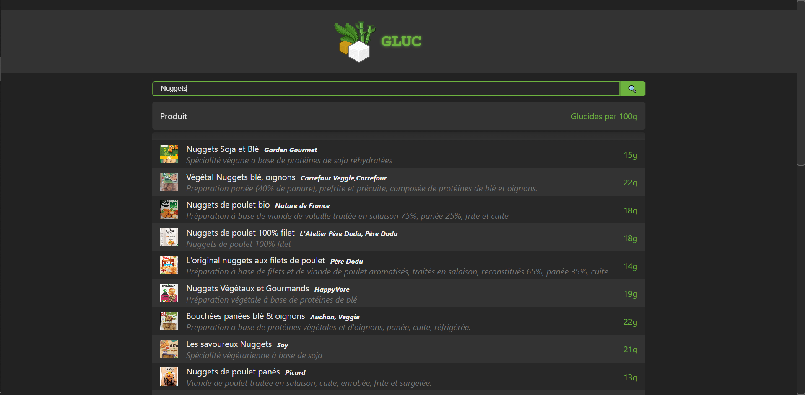
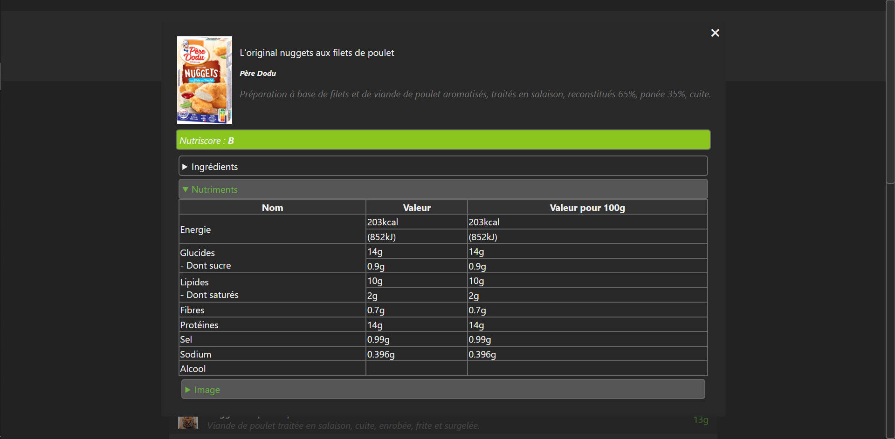

# Gluc

   
   
   

L'objectif principale de cette application est de rapidement pouvoir voir la quantité de glucide d'un produit.

Cette application React, récupére les données de l'API Open Food Facts pour lister les produits alimentaires et afficher la quantité de glucides pour chaque produit. C'est une manière pratique de visualiser les informations nutritionnelles des produits.

## Sommaire

- [Fonctionnalités](#fonctionnalités)
- [Captures d'écran](#captures-d'écran)
- [Installation](#installation)
- [Utilisation](#utilisation)
    - [Développement](#développement)
    - [Déployement](#déployement)
- [Auteur](#auteur)

## Fonctionnalités

- Liste des produits avec leurs noms, marques et quantité de glucides par 100g.
- Possibilité de filtrer les produits par recherche.
- Possibilité d'avoir plus d'information sur un produit.

## Captures d'écran


*Interface principale avec recherche*


*Informations supplémentaires sur un produit*

## Installation

1. Clônez ce dépôt vers votre machine locale.

```bash
git clone https://github.com/Tonaxis/Gluc
```

2. Accédez au répertoire du projet.

```bash
cd votre-projet
```

3. Installez les dépendances.

```bash
npm install
```

## Utilisation

### Développement

1. Lancez l'application en mode développement.

```bash
npm start
```

2. Ouvrez votre navigateur et accédez à l'[URL suivante](http://localhost:3000) :

```bash
http://localhost:3000
```

3. L'application devrait maintenant être visible dans votre navigateur, prête à être utilisée.

### Déployement


1. Lancez le build de l'application.

```bash
npm run build
```

2. Déployez le build.

```bash
serve -s build
```

3. Ouvrez votre navigateur et accédez à l'[URL suivante](http://localhost:3000) :

```bash
http://localhost:3000
```

4. L'application devrait maintenant être visible dans votre navigateur, prête à être utilisée.

## Auteur

[Tonaxis](https://github.com/Tonaxis)